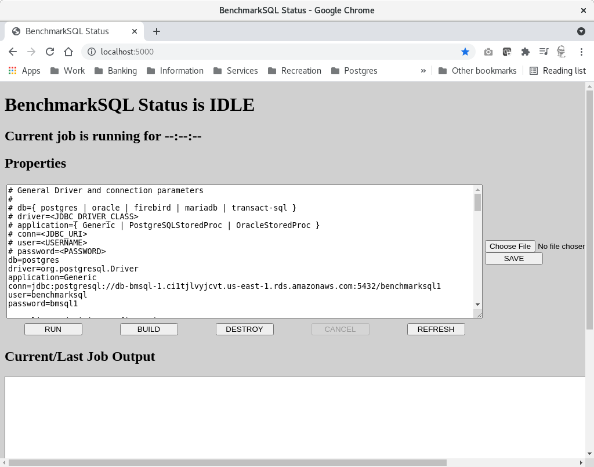

# BenchmarkSQL on Rocky Linux 8.4

## Contents
* [Placement and Sizing](#placement-and-sizing)
* [Installing Prerequisites](#installing-prereqesites)
  * [Installing EPEL](#installing-epel)
  * [Installing Java 11](#installing-java-11)
  * [Installing git](#installing-git)
  * [Installing Python packages](#installing-python-packages)
  * [Installing Maven](#installing-maven)
* [Cloning and Building BenchmarkSQL](#cloning-and-building-benchmarksql)
* [Launching the Flask UI and connecting to it](#launching-the-flask-ui-and-connecting-to-it)
  * [First test launching the UI](#first-test-launching-the-ui)
  * [Creating the secure shell port forward](#creating-the-secure-shell-port-forward)
  * [Connecting to the UI](#connecting-to-the-ui)
  * [Relaunching the UI disconnect-safe](#relaunching-the-ui-disconnect-safe)


## Placement and Sizing

In order to perform benchmarking against any
database the BenchmarkSQL application itself needs to be running
on a separate machine, virtual machine or container, close to
the database server.

Properly performing a benchmark also requires that the driver,
the system running the BenchmarkSQL application, has enough
CPU power and network bandwidth to generate client requests fast
enough. It would be a completely false performance result if the
number of transactions per minute fell short because the CPU of the
driver was overloaded. It is recommended that the driver system
has at least half the number of CPUs that the largest database server
under test will have. Oversizing the driver system will have no
negative influence on the test at all.

This tutorial will not teach you how to actually create a
suitable virtual machine environment. It is assumed that for the driver
machine you have a "Minimal" installation of Rocky Linux 8.4, that
you can log into that machine as the user "rocky" and that this user
has permission to use sudo. Substitute as needed if your setup is
different.

At this point log into the driver system:
```
ssh rocky@DRIVERADDR
```

## Installing Prerequisites

The following components are needed to build and run BenchmarkSQL:

* Extra Packages for Enterprise Linux (EPEL)
* Java 11 Development
* Git
* Python3
* Python numpy
* Python matplotlib
* Python jinja2
* Python Flask
* Python jproperties
* Apache Maven 3.1 or higher

### Installing EPEL

Install the Extra Packages for Enterprise Linux via dnf(8):
```
sudo yum install -y epel-release
```
Example:
```
[rocky@app2 ~]$ sudo yum install -y epel-release
Last metadata expiration check: 19:00:42 ago on Tue 24 Aug 2021 06:40:03 PM UTC.
Dependencies resolved.
================================================================================
 Package               Architecture    Version            Repository       Size
================================================================================
Installing:
 epel-release          noarch          8-10.el8           extras           22 k

Transaction Summary
================================================================================
Install  1 Package

Total download size: 22 k

[more output trimmed]

Installed:
  epel-release-8-10.el8.noarch

Complete!
```

### Installing Java 11

The same way we install the Java 11 JDK:
```
sudo yum install -y java-11-openjdk-devel
```
Example:
```
[rocky@app2 ~]$ sudo yum install -y java-11-openjdk-devel
Extra Packages for Enterprise Linux Modular 8 - 523 kB/s | 927 kB     00:01
Extra Packages for Enterprise Linux 8 - x86_64  2.3 MB/s |  10 MB     00:04
Last metadata expiration check: 0:00:01 ago on Wed 25 Aug 2021 01:58:10 PM UTC.
Dependencies resolved.
================================================================================
 Package                   Arch   Version                       Repo       Size
================================================================================
Installing:
 java-11-openjdk-devel     x86_64 1:11.0.12.0.7-0.el8_4         appstream 3.4 M
Installing dependencies:
 adwaita-cursor-theme      noarch 3.28.0-2.el8                  appstream 646 k
 adwaita-icon-theme        noarch 3.28.0-2.el8                  appstream  11 M
 alsa-lib                  x86_64 1.2.4-5.el8                   appstream 470 k
 at-spi2-atk               x86_64 2.26.2-1.el8                  appstream  88 k
 at-spi2-core              x86_64 2.28.0-1.el8                  appstream 168 k

[more output trimmed]
```

### Installing git

The Git version control system is needed later to clone
the BenchmarkSQL repository:
```
sudo yum install -y git
```
Example:
```
[rocky@app2 ~]$ sudo yum install -y git
Last metadata expiration check: 0:04:01 ago on Wed 25 Aug 2021 01:58:10 PM UTC.
Dependencies resolved.
================================================================================
 Package                Arch   Version                          Repo       Size
================================================================================
Installing:
 git                    x86_64 2.27.0-1.el8                     appstream 163 k
Installing dependencies:
 emacs-filesystem       noarch 1:26.1-5.el8                     baseos     68 k

[more output trimmed]
```

### Installing Python packages

Several Python3 packages are required to run the Flask UI and
to generate the reports. For that we create a Python Virtual Environment
and install them for the current user inside of it:
```
sudo yum install -y python3-virtualenv
```

```
virtualenv-3 --system-site-packages bmsql
. ~/bmsql/bin/activate
pip3 install numpy matplotlib jinja2 flask jproperties
```
Example:
```
[rocky@app2 ~]$ virtualenv-3 --system-site-packages bmsql
Using base prefix '/usr'
New python executable in /home/rocky/bmsql/bin/python3.6
Also creating executable in /home/rocky/bmsql/bin/python
Installing setuptools, pip, wheel...done.
[rocky@app2 ~]$ . ~/bmsql/bin/activate
(bmsql) [rocky@app2 ~]$ pip3 install numpy matplotlib jinja2 flask jproperties
Collecting numpy
  Downloading numpy-1.19.5-cp36-cp36m-manylinux2010_x86_64.whl (14.8 MB)
     |████████████████████████████████| 14.8 MB 11.3 MB/s

[more output trimmed]

Successfully installed MarkupSafe-2.0.1 Werkzeug-2.0.1 click-8.0.1 cycler-0.10.0 dataclasses-0.8 flask-2.0.1 importlib-metadata-4.6.4 itsdangerous-2.0.1 jinja2-3.0.1 jproperties-2.1.1 kiwisolver-1.3.1 matplotlib-3.3.4 numpy-1.19.5 pillow-8.3.1 pyparsing-2.4.7 six-1.16.0 typing-extensions-3.10.0.0 zipp-3.5.0
```

Remember to activate this Virtual Environment when you log in or
arrange for it to be activated via your bash profile.

### Installing Maven

The last requirement to install is Maven. Rocky Linux 8.4
has Maven 3.5.4 available, which satisfies our needs:
```
sudo yum install -y maven
```
We also need to create a file in ```/etc/profile.d``` that sets
a few environment variables so that Maven and the Flask UI
find the correct Java version:
```
sudo tee /etc/profile.d/maven.sh <<_EOF_
export JAVA_HOME=/usr/lib/jvm/java-11-openjdk
export PATH=\${JAVA_HOME}/bin:\${PATH}
_EOF_
# Source this now
. /etc/profile.d/maven.sh
```
With all that done check the Maven and Java versions:
```
mvn -version
```
**Make sure that in the following output the Maven version is 3.1 or higher
and the Java version is 11.**
```
(bmsql) [rocky@app2 ~]$ mvn -version
Apache Maven 3.5.4 (Red Hat 3.5.4-5)
Maven home: /usr/share/maven
Java version: 11.0.12, vendor: Red Hat, Inc., runtime: /usr/lib/jvm/java-11-openjdk-11.0.12.0.7-0.el8_4.x86_64
Default locale: en_US, platform encoding: UTF-8
OS name: "linux", version: "4.18.0-305.12.1.el8_4.x86_64", arch: "amd64", family: "unix"
```

## Cloning and Building BenchmarkSQL

We are now ready to clone the BenchmarkSQL
github repository and checkout the latest stable release tag:
```
git clone https://github.com/pgsql-io/benchmarksql.git
cd benchmarksql
git checkout REL6_0
```
Example:
```
(bmsql) [rocky@app2 ~]$ git clone https://github.com/pgsql-io/benchmarksql.git
Cloning into 'benchmarksql'...
remote: Enumerating objects: 2385, done.
remote: Counting objects: 100% (2385/2385), done.
remote: Compressing objects: 100% (981/981), done.
remote: Total 2385 (delta 1382), reused 2263 (delta 1263), pack-reused 0
Receiving objects: 100% (2385/2385), 5.64 MiB | 6.65 MiB/s, done.
Resolving deltas: 100% (1382/1382), done.
(bmsql) [rocky@app2 ~]$ cd benchmarksql
(bmsql) [rocky@app2 benchmarksql]$ git checkout REL6_0
HEAD is now at 5dc7881 Add change log for version 6.0
```

Build the project:
```
mvn
```
On the first ever run Maven will download all the dependencies like
JDBC drivers and other Java packages. So there will be a lot of output
scrolling by. The important bit at the end should look like:
```
[INFO] ------------------------------------------------------------------------
[INFO] BUILD SUCCESS
[INFO] ------------------------------------------------------------------------
[INFO] Total time:  14.346 s
[INFO] Finished at: 2021-08-20T13:26:56Z
[INFO] ------------------------------------------------------------------------
```

## Launching the Flask UI and connecting to it

BenchmarkSQL comes with a Flask based WEB UI. The UI at this point
is rudimentary but fully functional. For security reasons (there are
clear-text passwords in the traffic) we will NOT open up the TCP port
of the UI and connect directly. Instead we will start the UI and
create a secure shell tunnel with port forwarding so that our browser
can connect through the tunnel.

### First test launching the UI

For the first test we launch the UI in the foreground.
```
cd target/run
./FlaskService/main.py
```

### Creating the secure shell port forward

In a separate terminal window we use the following ssh(1) command
to cause the local port 5000/tcp to be forwarded to our driver
machine and from there connect to localhost:5000/tcp
```
ssh -N -L 5000:localhost:5000 rocky@DRIVERADDR
```

### Connecting to the UI

If everything went well so far, we can now point our web browser at
[http://localhost:5000] and it should look like this:



### Relaunching the UI disconnect-safe

The BenchmarkSQL Flask UI is meant to be run as a service. This has
the advantage that losing the connection to the driver machine
will not affect a running benchmark at all. One can simply restart
the ssh(1) tunnel and reconnect to the UI.

To do that we can simply stop the UI that is running in the foreground
with CTRL-C and then launch it via nohup(1) again in the background:
```
nohup ./FlaskService/main.py &
```
Example:
```
(bmsql) [rocky@app2 run]$ nohup ./FlaskService/main.py &
[1] 5591
(bmsql) [rocky@app2 run]$ nohup: ignoring input and appending output to 'nohup.out'
```

