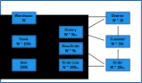

The TPC-C is an OLTP benchmark defined by the
[Transaction Processing Council](http://tpc.org). It consists of 9 tables
that are connected with 10 Foreign Key Relationships. Except for the **Item**
table, everything is scaled in cardinality by the number of warehouses (**W**),
that are generated during the initial load of the database.

This schema is used by 5 different transactions that produce a variety of
different access patterns on the tables. 

* **Item** is read only.
* **Warehouse**, **District**, **Customer** and **Stock** are read/write.
* **New-Order** is insert, read and delete, like a queue that at any given
  time has approximately W * 9000 rows in it.
* **Order** and **Order-Line** receive inserts and every row inserted will
  have a time delayed update to it, after which the row becomes stale and
  may be read infrequently in the future.
* **History** is insert only.

This is an impressive complexity and set of different access patterns for
such a small schema and number of transaction profiles. It is one of the
reasons why **TPC-C** is still one of the most important database benchmarks
today.

For more information, you can visit	the
[Standard specification from TPC](http://tpc.org/tpc_documents_current_versions/pdf/tpc-c_v5.11.0.pdf).