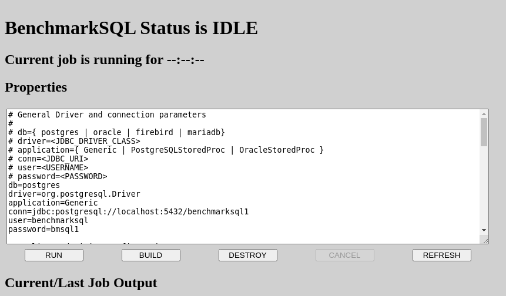

[comment]: # (TODO create alternative tutorials for other distros)

# Building and running BenchmarkSQL on CentOS 8

BenchmarkSQL is controlled through a Flask based WEB UI. This can
also be packaged into a Docker container for easy cloud deployment.
The build process itself is done via Maven. Building the container
is optional and requires Podman.

This tutorial will guide you step by step from an empty Linux system
to running a benchmark via the Flask UI. The parts omitted here are
setting up the database server itself. For this tutorial a CentOS 8
"minimal" install is used as the starting point.

The entire process is

* [Installing required packages](#installing-required-packages)
* [Cloning the BenchmarkSQL git repository](#cloning-the-benchmarksql-git-repository)
* [Installing Python requirements](#installing-python-requirements)
* [Building the target directory](#building-the-target-directory)
* [Preparing the test database](#preparing-the-test-database)
* [Performing the initial database load](#performing-the-initial-database-load)
* [Launching the BenchmarkSQL UI](#launching-the-benchmarksql-ui)
* [Next Steps](#next-steps)

## Installing required packages

This tutorial assumes that you have a [PostgreSQL](http://postgresql.org)
server available over the network or on your local Linux machine
and that it can be used with password
authentication. It is beyond the scope of this tutorial to show how
to create a PostgreSQL server, or any other database server instance.

First we need to install and configure a few required packages like
git and Maven.
```
[user@localhost ~]$ sudo dnf -y install epel-release java-11-openjdk-devel maven git python3
[user@localhost ~]$ sudo dnf config-manager --set-enabled powertools
```

Second we make Java-11 the system wide default version via alternatives.
`alternatives(8) --config` is interactive (which is why the output is
included below). Make sure you select the
option for java-11 in the following two commands.
```
[user@localhost ~]$ sudo alternatives --config java

There are 2 programs which provide 'java'.

  Selection    Command
-----------------------------------------------
*+ 1           java-1.8.0-openjdk.x86_64 (/usr/lib/jvm/java-1.8.0-openjdk-1.8.0.292.b10-0.el8_3.x86_64/jre/bin/java)
   2           java-11-openjdk.x86_64 (/usr/lib/jvm/java-11-openjdk-11.0.11.0.9-0.el8_3.x86_64/bin/java)

Enter to keep the current selection[+], or type selection number: 2
[user@localhost ~]$ sudo alternatives --config javac

There are 2 programs which provide 'javac'.

  Selection    Command
-----------------------------------------------
*+ 1           java-1.8.0-openjdk.x86_64 (/usr/lib/jvm/java-1.8.0-openjdk-1.8.0.292.b10-0.el8_3.x86_64/bin/javac)
   2           java-11-openjdk.x86_64 (/usr/lib/jvm/java-11-openjdk-11.0.11.0.9-0.el8_3.x86_64/bin/javac)

Enter to keep the current selection[+], or type selection number: 2
```

Maven also requires the **JAVA_HOME** environment variable to be
set correctly, so we add the following line to our .bash_profile and
make sure it is set in our current shell.

```
export JAVA_HOME=$(dirname $(dirname $(readlink $(readlink $(which javac)))))
```

**Note**: There are other ways to make Java version 11 the default on a
per user base. But that is outside the scope of this tutorial.

## Cloning the BenchmarkSQL git repository

We are now ready to clone the BenchmarkSQL git repository with
```
[user@localhost ~]$ git clone https://github.com/pgsql-io/benchmarksql.git
```

## Installing Python Requirements

The remaining dependencies are all Python modules that we will
install using pip3. The are listed in a requirements.txt file in
the repository.
```
[user@localhost ~]$ cd benchmarksql/
[user@localhost benchmarksql]$ sudo pip3 install -r src/main/resources/requirements.txt
```

## Building the target directory

We are now ready to build the actual benchmark driver. Assuming we
are still in the *~/benchmarksql* directory
```
[user@localhost benchmarksql]$ mvn
```
Yup, that's it. We should now have a directory *target* that contains a
file *BenchmarkSQL.jar* and a bunch of other stuff.
```
[user@localhost benchmarksql]$ ll target
total 104
-rw-rw-r--.  1 user user 97254 Apr 28 12:14 BenchmarkSQL.jar
drwxrwxr-x.  3 user user    17 Apr 28 12:14 classes
drwxrwxr-x.  3 user user    25 Apr 28 12:14 generated-sources
drwxrwxr-x.  2 user user  4096 Apr 28 12:14 lib
drwxrwxr-x.  2 user user    28 Apr 28 12:14 maven-archiver
drwxrwxr-x.  3 user user    35 Apr 28 12:14 maven-status
drwxrwxr-x. 10 user user  4096 Apr 28 12:14 run
```

## Preparing the test database

For the remainder of this tutorial it is assumed that the PostgreSQL
database is installed on a remote computer with IP address *172.21.8.33*.
If you are using a local database that is installed on your Linux
desktop, user *127.0.0.1* or *localhost* instead.

Connect to the PostgreSQL server as user *postgres* and create the user 
*benchmarksql* as well as a database *benchmarksql1* owned by that user.
```
-bash-4.2$ psql -U postgres
psql (14devel)
Type "help" for help.

postgres=# create user benchmarksql with password 'bmsql1';
CREATE ROLE
postgres=# create database benchmarksql1 owner benchmarksql;
CREATE DATABASE
```

## Performing the initial database load

If you did everything I did and actually worked on a minimum CentOS 8
install, then the machine you are running the benchmark on will not have
a graphical console. That is actually how BenchmarkSQL is intended to
be run. That is on a remote server that is in close proximity of the actual
database server, network wise and controlled with a browser and its
Flask UI.

In my example the machine where I built and will be running BenchmarkSQL
is on IP addres *172.21.8.128*. Flask is by default going to listen on
port *5000*, so I need to open up that TCP port in the firewall in order
to connect with my browser to it. Again, if you are running everything
on your local machine, just use *127.0.0.1* or *localhost* and forget
about the firewall.
```
[user@localhost benchmarksql]$ sudo firewall-cmd --zone public --add-port 5000/tcp
success
[user@localhost benchmarksql]$ sudo firewall-cmd --zone public --add-port 5000/tcp --permanent
success
```

## Launching the BenchmarkSQL UI

**NOTE: The BenchmarkSQL UI shown here is a Proof of Concept Prototype.
The final UI will be entirely different.**

Time to launch the actual BenchmarkSQL user interface and populate
the test database created above with the BenchmarkSQL tables, initial
data and other objects. Assuing we are still in the directory
*~/benchmarksql* (where we cloned the git repository):
```
[user@localhost benchmarksql]$ ./target/run/FlaskService/main.py 
created empty directory /home/user/benchmarksql/target/run/service_data
 * Serving Flask app "main" (lazy loading)
 * Environment: production
   WARNING: This is a development server. Do not use it in a production deployment.
   Use a production WSGI server instead.
 * Debug mode: off
 * Running on http://0.0.0.0:5000/ (Press CTRL+C to quit)
```
Now we can direct our browser to
[http://172.21.8.128:5000](http://172.21.8.128:5000)
(substitute with the proper IP address where you launched the UI) and
should see something like this:



In the **Properties** textbox adjust the URI for the JDBC connection
to the IP address of the DB server, then click `BUILD`.

For the first ever test you may also want to adjust the number of
minutes for the rampup and run times before clicking `RUN`.
Be patient, the benchmark is only going to generate a status line
reporting the current throughput every 30 seconds (there is a config
option in the Properties for that).

If the run is successful it will appear in the result table at
the bottom of the page and you can view the full HTML report by
clicking on **Show Report**.

## Next Steps

If you got this far you successfully built and ran BenchmarkSQL.
Congratulations!

[comment]: # (TODO add links to the follow up tutorials)

### Scaling the database size and transaction rate

The defaults in the sample Properties are not representing any
modern database server. How to properly scale the database and
get close to the maximum throughput (without completely violating
all TPC-C constraints at once) will fill an entire tutorial by
itself.

(TODO: link to tutorial)

### Collecting OS level metrics and extended reporting

Using collectd and an MQTT broker it is possible to collect OS
performance metrics, like CPU usage, disk and network IO. These can
be included in the BenchmarkSQL report.

(TODO: link to tutorial)

### Building the Docker/Podman container

To be covered in separate tutorial including how to deploy it
in the cloud.

(TODO: link to tutorial)


