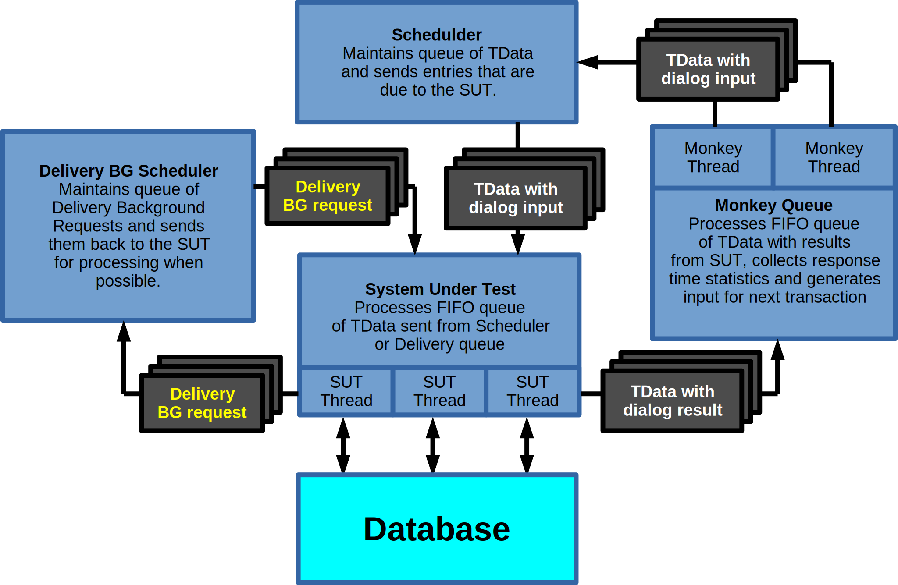

# BenchmarkSQL Timed Driver

## Introduction

The TPC-C specification is based on a 3-tier model where many Terminals with
human users submit requests (screen data) to an application, called System Under
Test (SUT) in the specification.
The SUT is actually the combination of application (tier 2) and database (tier
3).
The Terminals are supposed to be emulated and perform response time measurement.
While the Terminals are emulated, they are still supposed to act like (sane)
human users that need some time to enter the input data for a request and some
time to process the resulting output.

According to the specification, a terminal generates a request on average 21
seconds after it received the output for the previous transaction.
This is not a fixed 21 seconds wait between requests.
The actual wait time between two transactions depends on the two transaction
types and has a random element in it.
However, it is irrelevant when this request starts to be processed inside the
SUT or when the database transaction for the request is started.
The response time clock starts ticking when the simulated user hits the SEND
button and it stops when the response screen is received.

While trying to generate a TPC-C style workload as close as possible,
BenchmarkSQL focuses on the database performance.
A true 3-tier implementation is therefore impractical because it imposes
unnecessary installation complexity and hardware requirements for running the
driver.
The Timed Driver is an attempt to implement tiers 1 and 2 together in one tool
while still having the ability to measure the response times for tier 1, that
terminals in a true 3-tier implementation would experience.

## Scaling Problems

The TPC-C specification defines scaling rules.
The scale of the test is defined by the number of Warehouses.
Most of the database tables (except for the Item table) are directly
proportional in size to the number of configured Warehouses.
The on disk footprint of one Warehouse is approximately 100MB 1.

This scaling factor also defines the number of Terminals, to simulate and by
that, the maximum number of transaction requests, they can generate.
There must be 10 Terminals per Warehouse.
The average wait time between receiving the response for the previous
transaction and sending the request for the next transaction is 21 seconds 2.

Putting those numbers together it is very easy to see that a “one thread per
Terminal” implementation will most likely not work.
If we were to drive a 100GB database (in 2016 I consider that a small to
mid-size server), we would need to configure 1,000 Warehouses.
This would result in 10,000 Terminal Threads.
On an Operating System like CentOS-7 64bit, each thread uses by default 1MB of
stack space and the context switching between 10,000 threads would easily keep
several CPU cores busy by itself. Try to drive a 1TB database for a large server
and the whole model will fall apart.

It is also obvious that because of the large number of simulated Terminals,
the Terminal emulation part must be separate from the SUT emulation part having
the actual database connection. 10,000 (100,000 for a 1TB database) parallel
database connections, each submitting one transaction every 21 seconds on
average, is not going to work well either.

## Architecture of the BenchmarkSQL Timed Driver

To avoid the above problems, the Terminal in the BenchmarkSQL Timed Driver is
not a thread by itself, but a data structure that is passed around in queues
between several thread groups. 

## TData

The TData object has fields for all the input and output fields of the simulated
Terminal screen, a number of time stamps to measure response times and control
scheduling and fields used for linking in the various queues of the driver.

## Monkey Queue

Instead of simulating human users with a thread per Terminal, the driver has a
configurable number of “highly trained Monkeys”.
These can be imagined as jumping quickly from Terminal to Terminal to process
the output of the previous transaction (collect response time statistics),
type in the input data for the next transaction, calculate the time when this
input must be sent to the SUT based on thinking time of previous transaction +
keying time of new transaction, send it to the Scheduler and then jump to the
next Terminal, that needs attention.
Very few of these Monkey Threads can take care of thousands of Terminals.

It is possible to overwhelm the configured number of Monkey Threads with too
many Terminals, so that the Monkey Threads cannot generate the random input data
for the next transaction before it is due according to the last transaction's
end time plus the calculated wait time.
However, this is easily detected and the BenchmarkSQL Timed Scheduler will emit
warning messages if that ever happens.
Configuring more Monkey Threads will fix the problem.

## Scheduler

The Scheduler is a Thread that manages the TData objects, that have been
provided with Terminal input data by the Monkey Threads.
The objects are organized in a self balancing AVL tree sorted by the time stamp,
when each TData object is due to be sent to the SUT (due time is when the wait
time elapses).
The Scheduler has no other function than to send the TData objects to the SUT at
the exact time they are due. This due time is when the “virtual user” is
supposed to press the SEND button, which is also the time at which the user
experienced transaction response time starts ticking.

## System Under Test

The SUT consists of a FIFO queue and a number of SUT threads.
These are the simulated Application threads, each using its own database
connection to process transactions.
The number of SUT threads to configure depends on your database system and the
hardware, it is running on.
This can range from less than 10 for a small DB server with a dual-core CPU to
hundreds for a DB server with 64+ hyper-threaded cores or distributed systems. 

The SUT Threads pick the next TData object from the FIFO queue, process the
requested transaction and fill the result data into the TData object.
The last step before adding the TData object back into the Monkey Queue is to
record the transaction end timestamp in it.
This is when the user experienced transaction response time clock stops because
the result is now displayed on the Terminal.
A delay from here until the next available Monkey Thread actually pays attention
to the terminal does not count into the response time calculations, nor does it
affect the calculation of the next transaction's due time for this Terminal.

There can be times when the processing capacity of all the SUT Threads is not
enough to keep up with the flow of incoming TData objects (transaction
requests).
Unlike a TPC-B, where the processing capacity of the database system is
dictating the speed of a number of punch card readers, the TPC-C defines human
Terminal users, who dictate when a request starts.
When this overload happens it will cause a backlog in the Scheduler FIFO queue.
The response time clock keeps ticking while the TData object is waiting in this
queue for an available SUT Thread.
This is the major difference between the BenchmarkSQL Timed Driver and simpler
implementations.
Most simple TPC-C like implementations measure only the time between the
database transaction begin and commit, if they measure and eventually record any
individual transaction response times at all.
They behave like a TPC-B driver that has been modified to use a TPC-C like
schema and queries.
This behaviour and the inability to measure user-experienced response times is a
consequence of their implementation, where the simulated user+terminal
(TData+Monkey in our case) is combined with the SUT part and one database
connection into a single Thread. That model cannot perform the correct
measurement, neither can it deliver the correct timing of transaction requests.

## Delivery BG Scheduler

The DELIVERY transaction is unique in the TPC-C specification.
It has a foreground part where the Terminal communicates with the SUT, but this
foreground part does not require database interaction. It is meant to only
“queue” the delivery request and return the information that the request has
been queued back to the Terminal. 

The actual processing of the request should happen in the background an has
relaxed processing time requirements, because this is a very expensive
transaction with a lot of IO.
The TPC-C does not specify how exactly to implement the queue mechanism and
leaves it to the benchmark implementor.
The only requirement is that 90% of all DELIVERY background requests must be
finished within 85 seconds after the foreground part of the transaction had been
processed by the SUT. 

When an SUT Thread encounters a DELIVERY foreground transaction it creates a
special background TData object and sends it to the Delivery Background
Scheduler.
It fills the proper response message into the foreground TData object and sends
it back to the Monkey Queue.

The Delivery Background Scheduler is a special queue with a monitoring thread.
There is a configuration option in the BenchmarkSQL Timed Driver test properties
file that limits the number of SUT threads that are allowed to simultaneously
process Delivery Background Requests. This is to avoid having all database
connections busy with these longer running transactions and thereby delaying the
more time critical foreground transaction requests.

The driver also allows to configure the queue to avoid simultaneous execution of
multiple DELIVERY transactions per Warehouse, in order to avoid delays due to
conflicting lock requests by the inherently overlapping transactions.
Like all requests waiting in the SUT FIFO queue, background transactions waiting
in the Delivery BG Scheduler have their response time clock ticking, so the
TPC-C requirements are fulfilled.
If tuning these configuration options actually leads to an increase of
performance for your particular database configuration is a completely different
question.

When the Delivery Background Scheduler detects a request, that can be executed
according to the above configuration options, it sends the special TData object
into the SUT.
When the next available SUT Thread picks it up it will process the background
part of the DELIVERY transaction on the database, stamp the transaction end time
into the TData object and send it once more to the Delivery Background
Scheduler, which calculates the response time of the background part and adds
the result to the response time statistics. 
