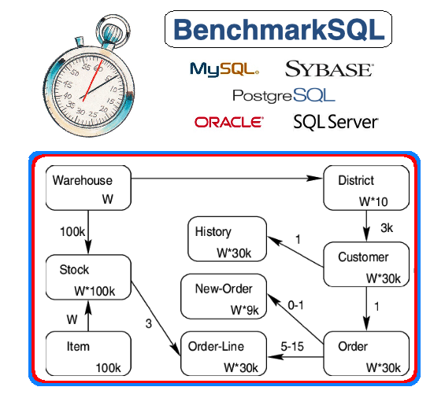

# Welcome to BenchmarkSQL

BenchmarkSQL is implemented in Java, using JDBC to stress test SQL databases.
The overall architecture is a series of data structures, queues and thread
groups that handle the simulated terminals, users and application threads. 

Its architecture allows BenchmarkSQL to drive TPC-C configurations up to many
thousands of warehouses (known as the scaling factor) without overwhelming the
job scheduler of the test driver itself.
Yet it is capable of doing so without sacrificing one of the most important
measurements in a TPC-C, the end-user experienced response time at the terminal.

